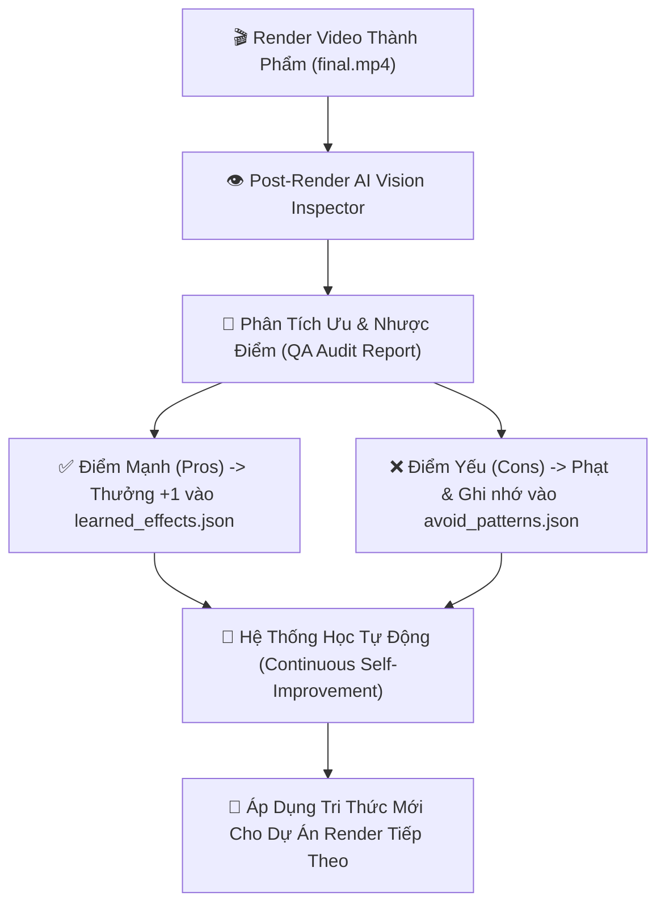

# IDEA-009: Closed-Loop AI Video Quality Audit & Self-Learning Engine (Hệ Thống AI Đánh Giá Video & Học Tự Động Sau Render)

> **Mục tiêu:** Xây dựng vòng lặp khép kín (Closed-Loop Learning System). Ngay sau khi video render thành công, AI Vision sẽ tự động xem lại thành phẩm, phân tích **Ưu điểm & Nhược điểm**, từ đó tự động nạp tri thức mới vào bộ nhớ hệ thống để các video sau **tự động thông minh và đẹp hơn theo thời gian**.

---

## 💡 1. Đặt Vấn Đề & Kiến Trúc Giải Pháp (System Architecture)

---

## 🔍 2. Tiêu Chí AI Đánh Giá Video Thành Phẩm (4 Trụ Cột QA)

1. **🎨 Bố Cục Thị Giác & Phụ Đề (Visual Composition & Layout):**
   - Vị trí Khung có đè lên chủ thể/gương mặt không?
   - Độ tương phản màu sắc chữ và nét viền có rõ ràng không?
   - Chữ có bị ngắt dòng mất cân đối hoặc quá sát lề không?

2. **⚡ Nhịp Động & Chuyển Cảnh (Pacing & Motion Flow):**
   - Độ mượt của hiệu ứng tua nhanh/chậm (Temporal Warp) có bị giật không?
   - Hiệu ứng chuyển cảnh giữa các phân cảnh có tự nhiên không?

3. **🔊 Âm Thanh & Nhạc Nền (Audio & BGM Alignment):**
   - Âm lượng Nhạc nền (BGM) có đè lên Giọng đọc (Voiceover) không?
   - Tiết tấu nhạc có ăn khớp với nhịp chuyển cảnh không?

4. **🎯 Sức Hút 3 Giây Đầu (Hook Retention):**
   - Cảnh Hook mở đầu có đủ gây tò mò, kịch tính để giữ chân người xem không?

---

## 🧠 3. Cơ Chế Học & Cập Nhật Tri Thức (Self-Learning Loop)

* **Bộ Nhớ Tích Cực (`effects/learned_effects.json`):**  
  Tăng trọng số ưu tiên cho các sự kết hợp hoàn hảo giữa `subtitle_style` + `advanced_effect` + `bgm_mood` có điểm đánh giá cao ($> 9/10$).
* **Bộ Nhớ Tránh Lỗi (`renderer/config/avoid_patterns.json`):**  
  Tự động ghi nhớ các kết hợp bị lỗi hoặc điểm thấp ($< 6/10$) để Generator & Optimizer tuyệt đối không lặp lại trong các kịch bản sau.

---

## 📋 4. Kế Hoạch Lộ Trình Triển Khai (Roadmap)

- [ ] **Giai đoạn 1:** Xây dựng script `videoQualityInspector.js` trích xuất frame & gọi Gemini Vision API kiểm tra video `final.mp4`.
- [ ] **Giai đoạn 2:** Định dạng cấu trúc JSON Báo cáo QA (`renderer/logs/qa_audits/`).
- [ ] **Giai đoạn 3:** Tích hợp bộ nạp tri thức tự động vào `effectLearning.js` & `avoid_patterns.json`.
- [ ] **Giai đoạn 4:** Tự động kích hoạt QA Audit ở bước cuối cùng trong `render.js`.
